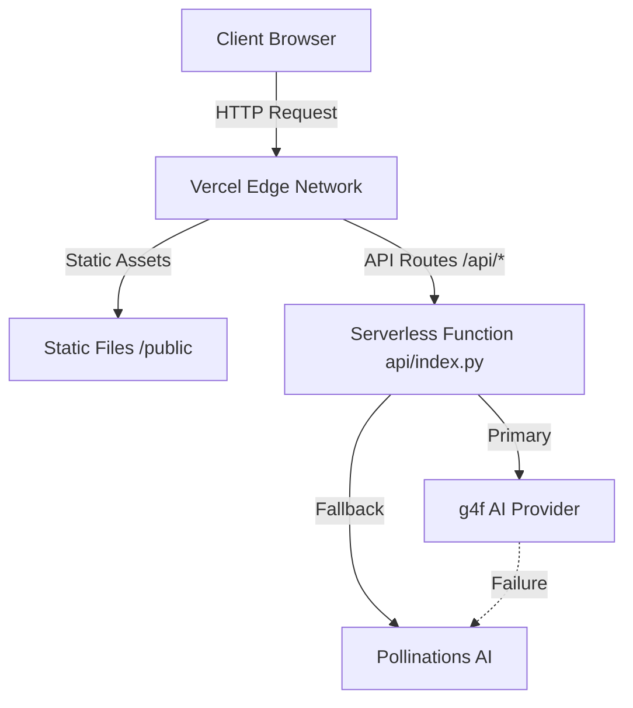

# Design Document: Vercel 500 Error Fix

## Overview

This design addresses the critical issues causing 500 server errors in the DUB5 chatbot application when deployed to Vercel. The solution focuses on adapting the FastAPI application to work within Vercel's serverless constraints while maintaining full functionality.

The core issues stem from:
1. Architectural mismatches between traditional server patterns and serverless execution
2. Import path inconsistencies between local and serverless environments
3. Static file serving approaches incompatible with Vercel's routing model
4. Missing timeout management for long-running AI requests
5. Insufficient error handling for serverless failure modes

The design implements environment-aware initialization, proper error boundaries, timeout management, and serverless-compatible file serving.

## Architecture

### High-Level Architecture



### Component Separation

The application will be restructured into three clear layers:

1. **Entry Point Layer** (`api/index.py`)
   - FastAPI application initialization
   - Route definitions
   - Environment detection
   - Static file handling delegation

2. **Business Logic Layer** (`api/chatbot_backup.py`)
   - AI streaming logic
   - Provider selection and fallback
   - Message processing
   - Context management

3. **Infrastructure Layer** (`vercel.json`, static routing)
   - Vercel configuration
   - Static file routing
   - Function resource allocation

### Environment Detection Strategy

```python
import os

class Environment:
    @staticmethod
    def is_vercel() -> bool:
        return os.environ.get("VERCEL") is not None
    
    @staticmethod
    def get_root_path() -> str:
        return "/api" if Environment.is_vercel() else ""
    
    @staticmethod
    def get_cache_dir() -> str:
        return "/tmp/.g4f_cache" if Environment.is_vercel() else ".g4f_cache"
```

## Components and Interfaces

### 1. Application Initialization Module

**Purpose:** Initialize FastAPI with environment-appropriate configuration

**Interface:**
```python
def create_app() -> FastAPI:
    """
    Creates and configures FastAPI application based on runtime environment.
    
    Returns:
        FastAPI: Configured application instance
    """
    pass

def configure_static_files(app: FastAPI, env: Environment) -> None:
    """
    Configures static file serving based on environment.
    In Vercel: delegates to vercel.json routing
    Locally: mounts StaticFiles
    
    Args:
        app: FastAPI application instance
        env: Environment detection helper
    """
    pass
```

**Behavior:**
- Detects runtime environment (Vercel vs local)
- Sets appropriate `root_path` for FastAPI
- Conditionally mounts static files only in local environment
- Configures CORS middleware
- Initializes logging with appropriate verbosity

### 2. Import Resolution Module

**Purpose:** Ensure consistent module imports across environments

**Interface:**
```python
def resolve_imports() -> None:
    """
    Validates and resolves all required imports.
    Raises ImportError with detailed diagnostics if imports fail.
    """
    pass

def get_chatbot_module():
    """
    Imports the chatbot streaming module with fallback logic.
    
    Returns:
        module: The chatbot_backup module
        
    Raises:
        ImportError: If module cannot be imported
    """
    pass
```

**Implementation Strategy:**
- Rename `chatbot_backup_old.py` to `chatbot_backup.py` to match import statement
- Use absolute imports (`from api.chatbot_backup import`) consistently
- Add try-except blocks around imports with informative error messages
- Log successful import paths for debugging

### 3. Endpoint Consolidation Module

**Purpose:** Ensure single definition of each endpoint

**Changes Required:**
- Remove duplicate `/health` endpoint definition (line ~150 in api/index.py)
- Keep the comprehensive health check implementation that tests both AI backends
- Ensure all endpoints have unique paths

**Final Endpoint Structure:**
```python
@app.get("/health")  # Single definition
async def health_check():
    # Comprehensive health check testing both backends
    pass

@app.get("/")
async def get_chatbot_html():
    # Serve main interface
    pass

@app.post("/api/chatbot")
async def chatbot_response(request: Request):
    # Main chat endpoint
    pass
```

### 4. Static File Handler Module

**Purpose:** Serve static files correctly in both environments

**Interface:**
```python
def serve_static_file(file_path: str) -> Response:
    """
    Serves a static file with appropriate error handling.
    
    Args:
        file_path: Relative path to static file
        
    Returns:
        Response: File content or error response
    """
    pass

def get_html_content(filename: str) -> str:
    """
    Reads HTML file content with error handling.
    
    Args:
        filename: Name of HTML file in public directory
        
    Returns:
        str: HTML content
        
    Raises:
        FileNotFoundError: If file doesn't exist
    """
    pass
```

**Implementation:**
- In Vercel: Read files directly from `public/` directory
- Locally: Use `StaticFiles` mount for efficiency
- Add proper error handling for missing files
- Return informative 404 responses with deployment hints

### 5. Timeout Management Module

**Purpose:** Ensure AI requests complete within Vercel's 60-second limit

**Interface:**
```python
async def stream_with_timeout(
    generator: AsyncGenerator,
    timeout_seconds: int = 50
) -> AsyncGenerator:
    """
    Wraps an async generator with timeout management.
    Sends heartbeats and enforces maximum duration.
    
    Args:
        generator: Source async generator
        timeout_seconds: Maximum duration before forced termination
        
    Yields:
        str: Chunks from generator or heartbeat messages
    """
    pass

async def send_heartbeat() -> str:
    """
    Generates SSE heartbeat message.
    
    Returns:
        str: SSE-formatted heartbeat
    """
    pass
```

**Implementation Strategy:**
```python
import asyncio
import time

async def stream_with_timeout(generator, timeout_seconds=50):
    start_time = time.time()
    last_heartbeat = start_time
    
    # Send immediate heartbeat
    yield ": heartbeat\n\n"
    
    try:
        async for chunk in generator:
            current_time = time.time()
            
            # Check timeout
            if current_time - start_time > timeout_seconds:
                yield f"data: {json.dumps({'type': 'timeout', 'content': 'Request timeout'})}\n\n"
                break
            
            # Send heartbeat every 10 seconds
            if current_time - last_heartbeat > 10:
                yield ": heartbeat\n\n"
                last_heartbeat = current_time
            
            yield chunk
            
    except asyncio.TimeoutError:
        yield f"data: {json.dumps({'type': 'timeout', 'content': 'Stream timeout'})}\n\n"
```

### 6. Error Handling Module

**Purpose:** Provide comprehensive error handling for serverless constraints

**Interface:**
```python
class ServerlessError(Exception):
    """Base exception for serverless-specific errors"""
    pass

class ImportFailureError(ServerlessError):
    """Raised when critical imports fail"""
    pass

class TimeoutError(ServerlessError):
    """Raised when operations exceed time limits"""
    pass

def handle_import_error(module_name: str, error: Exception) -> None:
    """
    Handles import failures with logging and fallback logic.
    
    Args:
        module_name: Name of module that failed to import
        error: The import exception
    """
    pass

def handle_ai_provider_error(provider: str, error: Exception) -> dict:
    """
    Handles AI provider failures and returns error response.
    
    Args:
        provider: Name of AI provider that failed
        error: The exception from provider
        
    Returns:
        dict: Structured error response
    """
    pass
```

**Error Response Format:**
```python
{
    "type": "error",
    "error_code": "PROVIDER_FAILURE",
    "message": "AI provider unavailable",
    "details": "g4f provider failed: Connection timeout",
    "timestamp": "2025-02-16T12:00:00Z",
    "retry_after": 60
}
```

### 7. AI Provider Fallback Module

**Purpose:** Implement robust fallback between g4f and Pollinations AI

**Interface:**
```python
class ProviderManager:
    def __init__(self):
        self.providers = ["g4f", "pollinations"]
        self.failure_counts = {"g4f": 0, "pollinations": 0}
        self.cooldown_until = {"g4f": 0, "pollinations": 0}
    
    def get_next_provider(self) -> str:
        """
        Selects next available provider based on health status.
        
        Returns:
            str: Provider name to use
        """
        pass
    
    def record_failure(self, provider: str) -> None:
        """
        Records provider failure and manages cooldown.
        
        Args:
            provider: Name of provider that failed
        """
        pass
    
    def record_success(self, provider: str) -> None:
        """
        Records provider success and resets failure count.
        
        Args:
            provider: Name of provider that succeeded
        """
        pass
```

**Fallback Logic:**
```python
async def stream_with_fallback(messages, model, **kwargs):
    provider_manager = ProviderManager()
    
    for attempt in range(2):  # Try primary, then fallback
        provider = provider_manager.get_next_provider()
        
        try:
            if provider == "g4f":
                async for chunk in stream_g4f(messages, model, **kwargs):
                    yield chunk
                provider_manager.record_success(provider)
                return
            else:
                async for chunk in stream_pollinations(messages, model, **kwargs):
                    yield chunk
                provider_manager.record_success(provider)
                return
                
        except Exception as e:
            logger.error(f"Provider {provider} failed: {e}")
            provider_manager.record_failure(provider)
            
            if attempt == 1:  # Last attempt
                yield json.dumps({
                    "type": "error",
                    "content": "All AI providers unavailable"
                })
```

## Data Models

### Configuration Model

```python
from dataclasses import dataclass
from typing import Optional

@dataclass
class ServerlessConfig:
    """Configuration for serverless deployment"""
    is_vercel: bool
    root_path: str
    cache_dir: str
    max_duration: int = 60
    memory_mb: int = 1024
    python_version: str = "3.9"
    
    @classmethod
    def from_environment(cls) -> 'ServerlessConfig':
        """Creates config from environment variables"""
        is_vercel = os.environ.get("VERCEL") is not None
        return cls(
            is_vercel=is_vercel,
            root_path="/api" if is_vercel else "",
            cache_dir="/tmp/.g4f_cache" if is_vercel else ".g4f_cache",
        )
```

### Health Status Model

```python
from pydantic import BaseModel
from typing import Optional, Literal

class BackendHealth(BaseModel):
    status: Literal["healthy", "unhealthy", "unresponsive", "unknown"]
    error: Optional[str] = None
    latency_ms: Optional[float] = None
    last_check: str

class SystemHealth(BaseModel):
    pollinations_ai: BackendHealth
    g4f_ai: BackendHealth
    timestamp: str
    version: str
```

### Error Response Model

```python
from pydantic import BaseModel
from typing import Optional

class ErrorResponse(BaseModel):
    type: Literal["error"]
    error_code: str
    message: str
    details: Optional[str] = None
    timestamp: str
    retry_after: Optional[int] = None
```

## Correctness Properties


A property is a characteristic or behavior that should hold true across all valid executions of a system—essentially, a formal statement about what the system should do. Properties serve as the bridge between human-readable specifications and machine-verifiable correctness guarantees.

### Property 1: No Duplicate Endpoints

*For any* FastAPI application instance after initialization, all registered endpoint paths should be unique with no duplicates.

**Validates: Requirements 1.1**

### Property 2: Structured Error Responses

*For any* exception that occurs during request processing, the system should return a JSON response with fields `type`, `error_code`, `message`, and `timestamp`, along with an appropriate HTTP status code (4xx or 5xx).

**Validates: Requirements 4.1**

### Property 3: Import Fallback Behavior

*For any* module import failure, if a fallback implementation exists, the system should continue execution using the fallback rather than crashing.

**Validates: Requirements 4.2**

### Property 4: File Operation Error Handling

*For any* file read operation that fails, the system should return either a 404 response (if file not found) or a 500 response (if other error) with a descriptive error message.

**Validates: Requirements 4.4**

### Property 5: Immediate Heartbeat on Stream Start

*For any* AI streaming request, the first message yielded should be a heartbeat (SSE comment line starting with `:`) to prevent immediate timeout.

**Validates: Requirements 5.1**

### Property 6: Provider Fallback on Failure

*For any* AI request where the g4f provider fails, the system should automatically attempt to use Pollinations AI as a fallback.

**Validates: Requirements 8.1**

### Property 7: Provider Failure Tracking

*For any* sequence of AI requests, if a provider fails, the system should increment that provider's failure count and adjust future provider selection to prefer providers with lower failure counts.

**Validates: Requirements 8.3**

### Property 8: Provider Cooldown After Consecutive Failures

*For any* provider that fails 3 consecutive times, the system should place that provider in cooldown and not select it for at least 5 minutes.

**Validates: Requirements 8.4**

### Property 9: Environment Detection

*For any* application startup, the system should correctly detect whether it's running on Vercel by checking for the `VERCEL` environment variable, and this detection should determine configuration choices.

**Validates: Requirements 9.1**

### Property 10: Environment-Specific Temporary Storage

*For any* runtime environment, the system should use `/tmp` for temporary storage when running on Vercel, and use a local `.g4f_cache` directory when running locally.

**Validates: Requirements 9.2, 9.3**

### Property 11: Environment-Specific Root Path

*For any* FastAPI application initialization, the `root_path` should be set to `/api` when running on Vercel and empty string when running locally.

**Validates: Requirements 9.4, 9.5**

### Property 12: Static File Mounting Based on Environment

*For any* application initialization in a Vercel environment, the system should not call `StaticFiles.mount()` to mount static directories.

**Validates: Requirements 3.1, 3.3**

### Property 13: Health Check Error Inclusion

*For any* backend that fails during a health check, the health response should include an error message describing the failure for that backend.

**Validates: Requirements 10.3**

### Property 14: Health Check Always Returns 200

*For any* health check request, regardless of backend health status, the HTTP response code should be 200 with status details in the response body.

**Validates: Requirements 10.5**

## Error Handling

### Error Categories

1. **Import Errors**
   - Missing modules
   - Version incompatibilities
   - Circular dependencies

2. **File System Errors**
   - Missing HTML files
   - Permission issues
   - Path resolution failures

3. **AI Provider Errors**
   - Connection timeouts
   - API failures
   - Rate limiting
   - Invalid responses

4. **Timeout Errors**
   - Request exceeds 60-second Vercel limit
   - AI provider response too slow
   - Network delays

5. **Configuration Errors**
   - Invalid environment variables
   - Missing required settings
   - Incompatible configurations

### Error Handling Strategy

**Graceful Degradation:**
- If g4f fails to import, use mock implementation and continue
- If static files can't be mounted, serve files directly
- If one AI provider fails, fall back to another
- If health check fails, return partial status

**Error Logging:**
```python
import logging
from typing import Optional

logger = logging.getLogger(__name__)

def log_error(
    error_type: str,
    message: str,
    exception: Optional[Exception] = None,
    context: Optional[dict] = None
):
    """
    Logs errors with structured context for debugging.
    
    Args:
        error_type: Category of error (import, file, provider, timeout, config)
        message: Human-readable error description
        exception: The exception object if available
        context: Additional context (request_id, user_id, etc.)
    """
    log_data = {
        "error_type": error_type,
        "message": message,
        "context": context or {}
    }
    
    if exception:
        log_data["exception"] = str(exception)
        log_data["exception_type"] = type(exception).__name__
    
    logger.error(json.dumps(log_data), exc_info=exception is not None)
```

**Error Response Format:**
All error responses should follow this structure:
```json
{
  "type": "error",
  "error_code": "PROVIDER_FAILURE",
  "message": "AI service temporarily unavailable",
  "details": "Both g4f and Pollinations AI failed to respond",
  "timestamp": "2025-02-16T12:00:00Z",
  "retry_after": 60,
  "request_id": "req_abc123"
}
```

### Timeout Handling

**Implementation:**
```python
import asyncio
import time
from typing import AsyncGenerator

async def with_timeout_protection(
    generator: AsyncGenerator,
    max_duration: int = 50,
    heartbeat_interval: int = 10
) -> AsyncGenerator:
    """
    Wraps async generator with timeout and heartbeat management.
    """
    start_time = time.time()
    last_heartbeat = start_time
    
    # Immediate heartbeat
    yield ": heartbeat\n\n"
    
    try:
        async for chunk in generator:
            current_time = time.time()
            elapsed = current_time - start_time
            
            # Check timeout
            if elapsed > max_duration:
                yield f"data: {json.dumps({
                    'type': 'timeout',
                    'content': 'Request exceeded time limit',
                    'elapsed': elapsed
                })}\n\n"
                break
            
            # Periodic heartbeat
            if current_time - last_heartbeat > heartbeat_interval:
                yield ": heartbeat\n\n"
                last_heartbeat = current_time
            
            yield chunk
            
    except asyncio.TimeoutError:
        yield f"data: {json.dumps({
            'type': 'timeout',
            'content': 'Stream timeout'
        })}\n\n"
    finally:
        end_time = time.time()
        duration = end_time - start_time
        yield f"data: {json.dumps({
            'type': 'end',
            'duration': duration
        })}\n\n"
```

## Testing Strategy

### Dual Testing Approach

This project will use both unit tests and property-based tests to ensure comprehensive coverage:

**Unit Tests:**
- Specific examples of correct behavior
- Edge cases (empty inputs, missing files, import failures)
- Integration points between components
- Error conditions with specific inputs

**Property-Based Tests:**
- Universal properties that hold for all inputs
- Comprehensive input coverage through randomization
- Minimum 100 iterations per property test
- Each property test references its design document property

### Property-Based Testing Configuration

We will use `pytest` with `hypothesis` for property-based testing in Python:

```python
from hypothesis import given, strategies as st
import pytest

# Example property test
@given(st.text())
def test_error_response_structure(error_message: str):
    """
    Property 2: Structured Error Responses
    Feature: vercel-500-fix, Property 2: For any exception, return structured error
    """
    # Simulate an error
    response = handle_error(Exception(error_message))
    
    # Verify structure
    assert "type" in response
    assert "error_code" in response
    assert "message" in response
    assert "timestamp" in response
    assert response["type"] == "error"
```

### Test Organization

```
tests/
├── unit/
│   ├── test_imports.py          # Test import resolution
│   ├── test_endpoints.py        # Test endpoint definitions
│   ├── test_static_files.py     # Test static file serving
│   └── test_health_check.py     # Test health endpoint
├── property/
│   ├── test_error_handling.py   # Property tests for error handling
│   ├── test_environment.py      # Property tests for environment detection
│   ├── test_providers.py        # Property tests for AI provider fallback
│   └── test_timeouts.py         # Property tests for timeout management
└── integration/
    ├── test_full_request.py     # End-to-end request tests
    └── test_vercel_deployment.py # Vercel-specific integration tests
```

### Key Test Scenarios

**Unit Test Examples:**
1. Test that `/health` endpoint exists and returns expected structure
2. Test that `api.chatbot_backup` can be imported successfully
3. Test that root path `/` returns HTML content
4. Test that missing files return 404 with descriptive message
5. Test that timeout configuration is set to 50 seconds

**Property Test Examples:**
1. For any FastAPI app, no duplicate endpoints exist (Property 1)
2. For any exception, structured error response is returned (Property 2)
3. For any environment variable state, correct paths are selected (Properties 10, 11)
4. For any provider failure, fallback is attempted (Property 6)
5. For any health check, 200 status is returned (Property 14)

### Testing Vercel-Specific Behavior

To test Vercel-specific behavior locally:

```python
import os
import pytest

@pytest.fixture
def vercel_environment(monkeypatch):
    """Simulates Vercel environment"""
    monkeypatch.setenv("VERCEL", "1")
    yield
    monkeypatch.delenv("VERCEL")

def test_vercel_root_path(vercel_environment):
    """Test that root_path is /api in Vercel environment"""
    config = ServerlessConfig.from_environment()
    assert config.root_path == "/api"
    assert config.cache_dir == "/tmp/.g4f_cache"

def test_local_root_path():
    """Test that root_path is empty locally"""
    config = ServerlessConfig.from_environment()
    assert config.root_path == ""
    assert config.cache_dir == ".g4f_cache"
```

### Continuous Testing

- Run unit tests on every commit
- Run property tests with 100 iterations in CI/CD
- Run integration tests before deployment
- Monitor error rates in production to validate error handling
